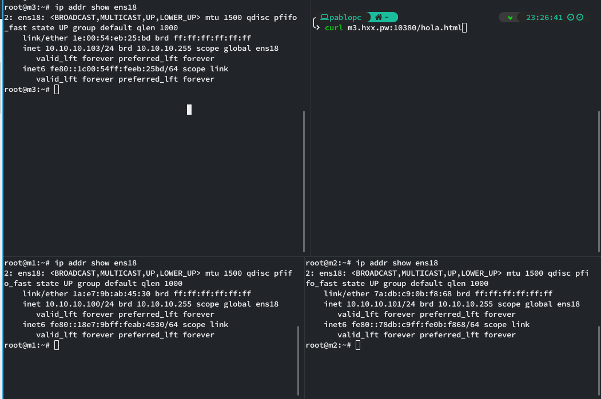
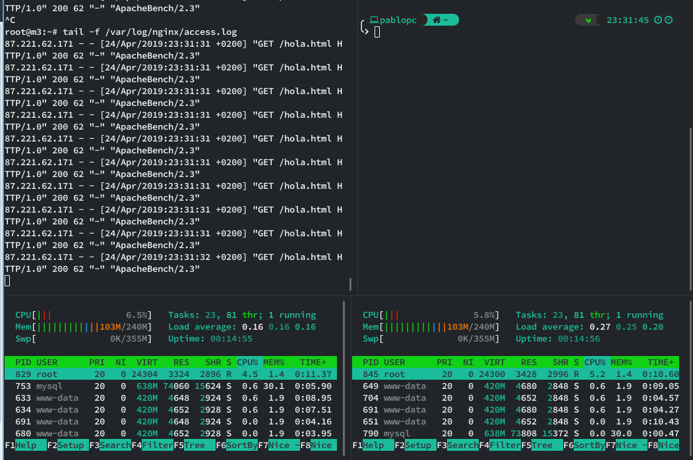
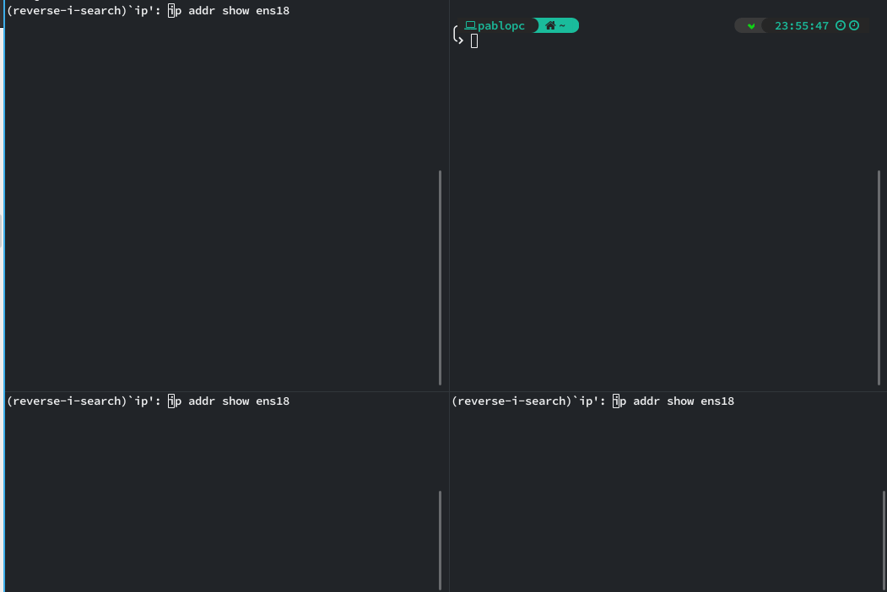

# Estructura de red

### Esquema
```
     XXX          XXXXXXXX
   XXX XXXX   XXXXX      X
  X       XXXX          X       DNAT through proxmox host
 XX                     XX+----------------v
 X         Internet      X                 |
 XXX                     X                 |
    XXXXXXXX     XXXXXXXX                  |
           XXXXXX                          |
              +                            |
              |                            |       Proxmox VM's
              |           +-----------------------------------------------------------+
              |           |                |                                          |
              |           |                |                     +-------------+      |
              v           |                |             +------>+ Server1     |      |
+-------------+-----------+                v             |       +-------------+      |
| Proxmox  Cloud (hxx.pw) |          +-----+-------+     |       10.10.10.100:80      |
|    Ext: 159.69.199.21   |          |Load Balancer+-----+                            |
|    Int: 10.10.10.1/24   |          +-------------+     |                            |
+-------------------------+          10.10.10.103:80     |       +-------------+      |
                          |                              +------>+ Server2     |      |
                          |                                      +-------------+      |
                          |                                      10.10.10.101:80      |
                          |                                                           |
                          +-----------------------------------------------------------+

```
### Configuración de red
DNS
```
hxx.pw A 159.69.199.21
```
DNAT
```
hxx.pw:10[1|2|3][22|80] = DNAT 10.10.10.1 --> 10.10.10.10[1|2|3]:[22|80]
```
Ejemplo:
```
hxx.pw:10380 = DNAT 10.10.10.1 --> 10.10.10.103:80
```

# Balanceo de carga con Nginx
## Configuración
`/etc/nginx/sites-available/default`
```
upstream webservers{
        server 10.10.10.100 weight=1;
        server 10.10.10.101 weight=2;
}

server {
        listen 80 default_server;
        server_name _;

        location / {
                proxy_pass http://webservers;
                proxy_set_header Host $host;
                proxy_set_header X-Real-IP $remote_addr;
                proxy_set_header X-Forwarded-For $proxy_add_x_forwarded_for;
                proxy_http_version 1.1;
                proxy_set_header Connection "";
        }
}
```
## Demostración
### Configuración y test con curl

### Apache Benchmark

### Benchmark result
```
Server Software:        nginx/1.10.3
Server Hostname:        m3.hxx.pw
Server Port:            10380

Document Path:          /hola.html
Document Length:        62 bytes

Concurrency Level:      10
Time taken for tests:   23.655 seconds
Complete requests:      2000
Failed requests:        0
Total transferred:      596000 bytes
HTML transferred:       124000 bytes
Requests per second:    84.55 [#/sec] (mean)
Time per request:       118.275 [ms] (mean)
Time per request:       11.827 [ms] (mean, across all concurrent requests)
Transfer rate:          24.61 [Kbytes/sec] received

Connection Times (ms)
              min  mean[+/-sd] median   max
Connect:       41   47  22.9     47    1047
Processing:    48   70  12.5     68     138
Waiting:       47   69  12.5     67     138
Total:         90  117  26.5    115    1117

Percentage of the requests served within a certain time (ms)
  50%    115
  66%    121
  75%    125
  80%    128
  90%    135
  95%    142
  98%    151
  99%    160
 100%   1117 (longest request)
```

# Balanceo de carga con Haproxy
## Configuración
`/etc/haproxy/haproxy.cfg`
```
global
        log /dev/log    local0
        log /dev/log    local1 notice
        daemon
        maxconn 256

defaults
        log     global
        mode    http
        option httplog
        timeout connect 5000
        timeout client  50000
        timeout server  50000

frontend http
        bind 10.10.10.103:80
        default_backend webservers

backend webservers
        balance roundrobin
        server m1 10.10.10.100:80 weight 1
        server m2 10.10.10.101:80 weight 2
```
## Demostración
### Configuración y test con curl

### Apache Benchmark

### Benchmark result
```
Server Software:        Apache/2.4.25
Server Hostname:        m3.hxx.pw
Server Port:            10380

Document Path:          /hola.html
Document Length:        62 bytes

Concurrency Level:      10
Time taken for tests:   24.555 seconds
Complete requests:      2000
Failed requests:        0
Total transferred:      616000 bytes
HTML transferred:       124000 bytes
Requests per second:    81.45 [#/sec] (mean)
Time per request:       122.775 [ms] (mean)
Time per request:       12.278 [ms] (mean, across all concurrent requests)
Transfer rate:          24.50 [Kbytes/sec] received

Connection Times (ms)
              min  mean[+/-sd] median   max
Connect:       41   47   4.9     47      95
Processing:    48   75  20.7     70     306
Waiting:       48   75  20.7     70     306
Total:         90  122  22.3    117     348

Percentage of the requests served within a certain time (ms)
  50%    117
  66%    125
  75%    131
  80%    136
  90%    150
  95%    165
  98%    185
  99%    197
 100%    348 (longest request)
```