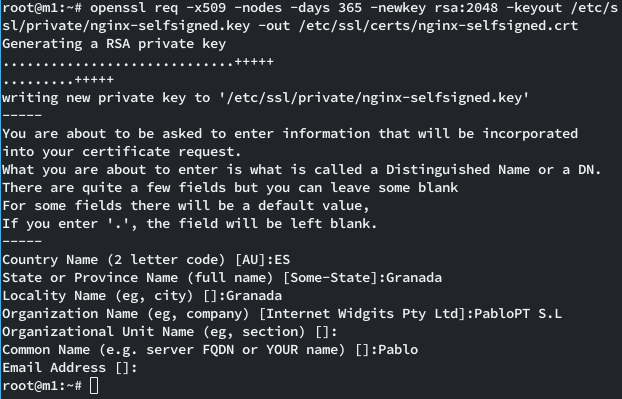
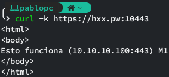
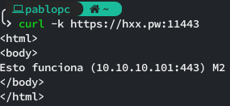
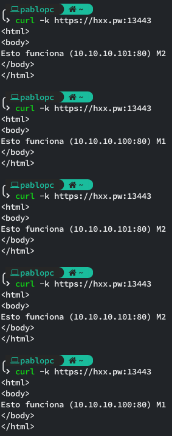
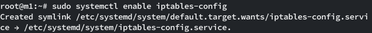
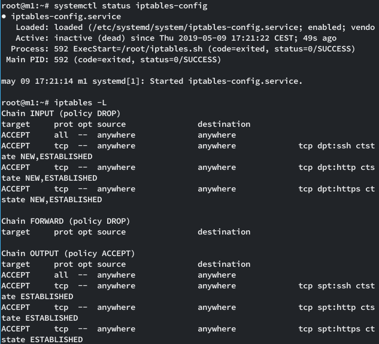
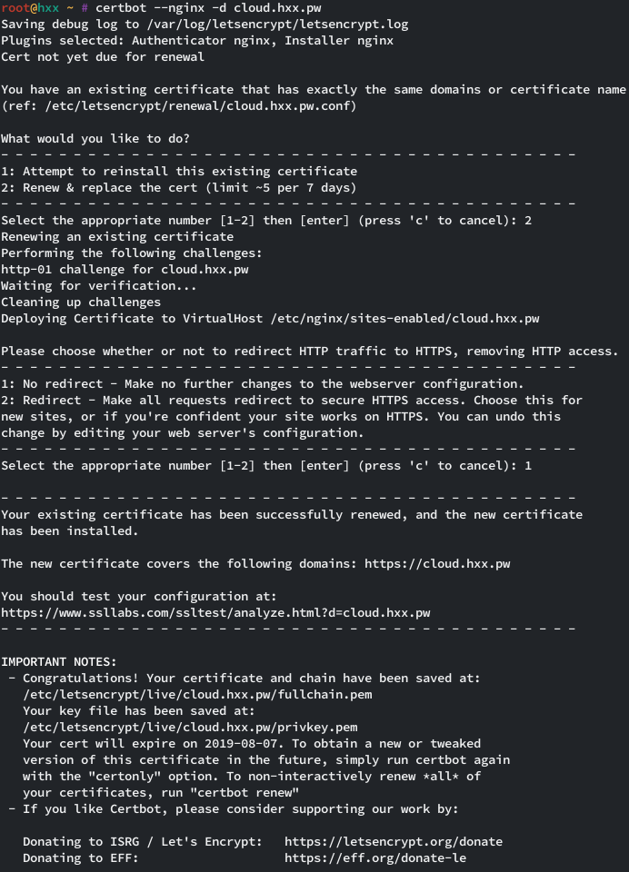

# Estructura de red

### Esquema
```
     XXX          XXXXXXXX
   XXX XXXX   XXXXX      X                          DNAT through proxmox host
  X       XXXX          X
 XX                     XX+----------------+---------------------------------------+--------------------+
 X         Internet      X                 |                                       |                    |
 XXX                     X                 |                                       |                    |
    XXXXXXXX     XXXXXXXX           hxx.pw:13[22|80|443]                 hxx.pw:10[22|80|443]    hxx.pw:11[22|80|443] 
           XXXXXX                          |                                       |                    |
              +                            |                                       |                    |
              |                            |                                       |                    |
              |           +-------------------------------------------------------------------------+   |
              |           |                |                                       |                |   |
              |           |                |                                +------v------+         |   |
              v           |                |                        +------>+ Server1     |         |   |
+-------------+-----------+                v                        |       +-------------+         |   |
| Proxmox  Cloud (hxx.pw) |          +-----+-------+                |    10.10.10.100:[22|80|443]   |   |
|    Ext: 159.69.199.21   |          |Load Balancer+--------------->+                               |   |
|    Int: 10.10.10.1/24   |          +-------------+                |                               |   |
+-------------------------+          10.10.10.103:[22|80|443]       |       +-------------+         |   |
                          |                                         +------>+ Server2     <-------------+
                          |                                                 +-------------+         |
                          |                                              10.10.10.101:[22|80|443]   |
                          |                                                                         |
                          +-------------------------------------------------------------------------+
                                                        Proxmox VM's
```
### Configuración de red
DNS
```
hxx.pw A 159.69.199.21
```
DNAT
```
hxx.pw:1[1|2|3][22|80|443] = DNAT 10.10.10.1 --> 10.10.10.10[1|2|3]:[22|80|443]
```
Ejemplo:
```
hxx.pw:1380 = DNAT 10.10.10.1 --> 10.10.10.103:80
```

# Acceso HTTPS
## Generación del certificado autofirmado
1. `openssl req -x509 -nodes -days 365 -newkey rsa:2048 -keyout /etc/ssl/private/nginx-selfsigned.key -out /etc/ssl/certs/nginx-selfsigned.crt`
##


## Configuración servidores Apache2
1. `a2enmod ssl`
2. `nano /etc/apache2/sites-available/default-ssl.conf`
```
<IfModule mod_ssl.c>
        <VirtualHost _default_:443>
                ServerAdmin webmaster@localhost

                DocumentRoot /var/www/html

                DirectoryIndex index-ssl.html

                SSLEngine on

                SSLCertificateFile      /etc/ssl/certs/nginx-selfsigned.crt
                SSLCertificateKeyFile /etc/ssl/private/nginx-selfsigned.key

        </VirtualHost>
</IfModule>
```
3. `systemctl restart apache2`
### Demostración Apache2
#### Curl a M1 (servidor 1 apache2)

#### Curl a M2 (servidor 2 apache2)



## Configuración Balanceador Nginx
```
upstream webservers{
        server 10.10.10.100 weight=1;
        server 10.10.10.101 weight=2;
}

server {
        listen 80 default_server;

        server_name _;

        location / {
                proxy_pass http://webservers;
                proxy_set_header Host $host;
                proxy_set_header X-Real-IP $remote_addr;
                proxy_set_header X-Forwarded-For $proxy_add_x_forwarded_for;
                proxy_http_version 1.1;
                proxy_set_header Connection "";
        }

}
 
server {
        listen 443 ssl;

        server_name _;

        ssl on;
        ssl_certificate /etc/ssl/certs/nginx-selfsigned.crt;
        ssl_certificate_key /etc/ssl/private/nginx-selfsigned.key;
 
        location / {
                proxy_pass http://webservers;
                proxy_set_header Host $host;
                proxy_set_header X-Real-IP $remote_addr;
                proxy_set_header X-Forwarded-For $proxy_add_x_forwarded_for;
                proxy_http_version 1.1;
                proxy_set_header Connection "";
        }

}

```
### Demostración Balanceador Nginx
#### Curl a M3 (balanceador nginx)



# Restricción de puertos con IPTables
Aunque los servidores M1, M2 y M3 ya están restringidos con las reglas NAT correspondientes, voy a configurar iptables en M1 para que solo acepte conexiones SSH, HTTP y HTTPS.
## Reglas
1. Crear script iptables: 

`nano /root/iptables.sh`
```
#!/bin/bash

# Bloquear todo el trafico entrante
iptables -P INPUT DROP
iptables -P FORWARD DROP
iptables -P OUTPUT ACCEPT

# Aceptar trafico en interfaz loopback
iptables -A INPUT -i lo -j ACCEPT
iptables -A OUTPUT -o lo -j ACCEPT

# Aceptar puerto 22
iptables -A INPUT -p tcp --dport 22 -m conntrack --ctstate NEW,ESTABLISHED -j ACCEPT
iptables -A OUTPUT -p tcp --sport 22 -m conntrack --ctstate ESTABLISHED -j ACCEPT

# Aceptar puerto 80
iptables -A INPUT -p tcp --dport 80 -m conntrack --ctstate NEW,ESTABLISHED -j ACCEPT
iptables -A OUTPUT -p tcp --sport 80 -m conntrack --ctstate ESTABLISHED -j ACCEPT

# Aceptar puerto 443
iptables -A INPUT -p tcp --dport 443 -m conntrack --ctstate NEW,ESTABLISHED -j ACCEPT
iptables -A OUTPUT -p tcp --sport 443 -m conntrack --ctstate ESTABLISHED -j ACCEPT
```

2. Creación del servicio: 

`nano /etc/systemd/system/iptables-config.service`
```
[Unit]
After=network.target

[Service]
ExecStart=/root/iptables.sh

[Install]
WantedBy=default.target
```

3. Activación



4. Resultado



# Generación certificado con Certbot
Dado que yo ya tengo generado un certificado para mi dominio personal, voy a ejecutar el comando de generación para regenerar el certificado actual y así renovarlo.

En el caso de no existir el certificado, se crearía con el mismo comando.

