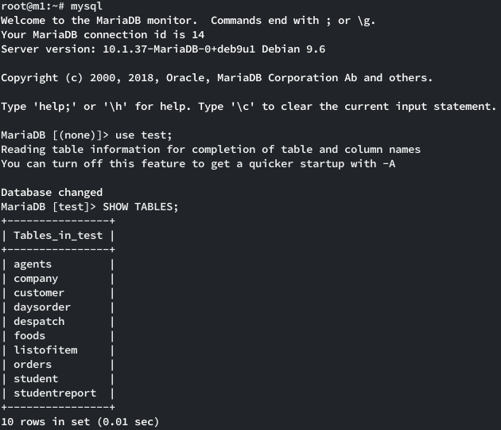

# Estructura de red

### Esquema
```
     XXX          XXXXXXXX
   XXX XXXX   XXXXX      X                          
  X       XXXX          X                 DNAT through proxmox host
 XX                     XX+----------------+-----------------------------+
 X         Internet      X                 |                             |
 XXX                     X                 |                             |
    XXXXXXXX     XXXXXXXX           hxx.pw:10[22|80|443]       hxx.pw:11[22|80|443]   
           XXXXXX                          |                             |
              +                            |                             |
              |                            |                             |
              |           +---------------------------------------------------------------------+
              |           |                |                             |                      |
+-------------v-----------+                |                             |                      |
| Proxmox  Cloud (hxx.pw) |          +-----v------+                +-----v-----+                |
|    Ext: 159.69.199.21   |          |   Master   +--------------->+   Slave   +                |
|    Int: 10.10.10.1/24   |          +------------+                +-----------+                |
+-------------------------+          10.10.10.100:[22|3306]        10.10.10.101:[22|3306]       |
                          |                                                                     |
                          +---------------------------------------------------------------------+
                                                        Proxmox VM's
```
### Configuración de red
DNS
```
hxx.pw A 159.69.199.21
```
DNAT
```
hxx.pw:1[1|2|3][22|80|443] = DNAT 10.10.10.1 --> 10.10.10.10[1|2|3]:[22|80|443]
```
Ejemplo:
```
hxx.pw:1022 = DNAT 10.10.10.1 --> 10.10.10.100:22
```

# Replicación Master-Slave con MariaDB
## Configuracion previa
### Master
Activar binlog, establecer server_id y escuchar en todas las interfaces:
- `nano /etc/mysql/mariadb.conf.d/60-server-master.cnf`
```
[mariadb]
log-bin
server_id=1
log-basename=master1
bind-address = 0.0.0.0
```
Crear usuario de replicación
- `mysql`
```
CREATE USER 'repl'@'%' IDENTIFIED BY 'replpass';
GRANT REPLICATION SLAVE ON *.* TO 'repl'@'%';
```

- `systemctl restart mariadb`
### Slave
Establecer server_id:
- `nano /etc/mysql/mariadb.conf.d/60-server-slave.cnf`
```
[mariadb]
server_id=2
```
- `systemctl restart mariadb`
## Creación de base de datos de pruebas
### Master
Para realizar la prueba me voy a servir de la base de datos de ejemplo proporcionada por w3resource: https://www.w3resource.com/sql/sample-database-of-sql-in-mysql-format.txt
1. `wget https://www.w3resource.com/sql/sample-database-of-sql-in-mysql-format.txt -O database.sql`
2. `mysql -e "CREATE DATABASE test;"`
3. `mysql test < database.sql`

Resultado


## Realizar dump y restaurar en esclavo.
### Master
Si ejecutamos mysqldump con --master-data=1, se incluirá la sentencia "CHANGE MASTER TO..." para poner el esclavo en la coordenada de replicación correcta.
- `mysqldump --all-databases --master-data=1 > master-dump.sql`
- `scp master-dump.sql m2:/tmp/master-dump.sql`
### Slave
Restauramos el dump del maestro.
- `mysql < /tmp/master-dump.sql`

Ya que es la primera vez que realizamos la importación, tenemos que poner las credenciales del usuario de replicación. En las siguientes ejecuciones esto no haría falta.

- `CHANGE MASTER TO MASTER_HOST='m1', MASTER_USER='repl', MASTER_PASSWORD='replpass', MASTER_PORT=3306;`

Para finalizar, activamos el esclavo:

- `START SLAVE;`

Podemos ver como el esclavo empieza a replicar correctamente desde la posición que le indica el dump del maestro:
- `head -30 master-dump.sql`


- `SHOW SLAVE STATUS\G;`


# Replicación Master-Master con MariaDB
## Configuración previa
### Master1
Activar binlog, establecer server_id y escuchar en todas las interfaces:
- `nano /etc/mysql/mariadb.conf.d/60-server-master.cnf`
```
[mariadb]
log-bin
server_id=1
log-basename=master1
bind-address = 0.0.0.0
```
Crear usuario de replicación
- `mysql`
```
CREATE USER 'repl'@'%' IDENTIFIED BY 'replpass';
GRANT REPLICATION SLAVE ON *.* TO 'repl'@'%';
```

- `systemctl restart mariadb`
### Master2
Activar binlog, establecer server_id y escuchar en todas las interfaces:
- `nano /etc/mysql/mariadb.conf.d/60-server-master.cnf`
```
[mariadb]
log-bin
server_id=2
log-basename=master2
bind-address = 0.0.0.0
```
- `systemctl restart mariadb`

## Realizar dump y restaurar en Master2
Este paso es exáctamente igual que lo realizado en el paso de dump y restauración para Master-Slave.

## Activar replicación en Master1
Para realizar esto, lo primero que voy a hacer es bloquear las base de datos frente a escrituras para no crear inconsistencias:
### Master1 y Master2
`FLUSH TABLES WITH READ LOCK;`

### Master2
`SHOW MASTER STATUS;`

### Master1
Ejecutar el siguiente comando con el resultado del Master Status anterior:

`CHANGE MASTER TO MASTER_HOST = 'm2', MASTER_USER = 'repl', MASTER_PASSWORD = 'replpass', MASTER_LOG_FILE = 'master2-bin.00000x', MASTER_LOG_POS = xxxxx;`


Activamos el esclavo:

`START SLAVE;`

### Master1 y Master2
`UNLOCK TABLES;`

Podemos comprobar como se estan los dos esclavos activos, cada uno como Master del otro.


Para acabar, voy a probar que la replicación funciona correctamente en los dos maestros:
