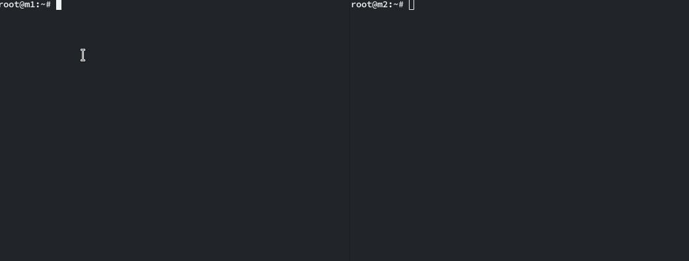

# Estructura de red

### Esquema
```
    XXX          XXXXXXXX
  XXX XXXX   XXXXX      X
 X       XXXX          X
XX                     XX
X         Internet      X
XXX                     X
   XXXXXXXX     XXXXXXXX
          XXXXXX
             +           +-------------------------------------------------+
             |           |                                 +-----v-----+   |
             |           |                        +-------->  Client   |   |
+------------v-----------+                        |        +-----------+   |
| Proxmox  Cloud (hxx.pw)|  +-----v------+        |        10.10.10.100    |
|    Ext: 159.69.199.21  |  | NFS Server +-------->                        |
|    Int: 10.10.10.1/24  |  +------------+        |                        |
+------------------------+  10.10.10.103          |        +-----v-----+   |
                         |                        +-------->  Client   |   |
                         |                                 +-----------+   |
                         |                                 10.10.10.101    |
                         +-------------------------------------------------+
                                           Proxmox VM's

```
### Configuración de red
DNS
```
hxx.pw A 159.69.199.21
```
DNAT
```
hxx.pw:1[1|2|3][22|80|443] = DNAT 10.10.10.1 --> 10.10.10.10[1|2|3]:[22|80|443]
```
Ejemplo:
```
hxx.pw:1022 = DNAT 10.10.10.1 --> 10.10.10.100:22
```

# Servidor NFS
## Requisitos previos
### Servidor
Instalar paquete del servidor NFS.
- `apt-get install nfs-kernel-server nfs-common`

### Cliente
Instalar paquete para soporte NFS:
- `apt-get install nfs-common`

## Configuración
### Servidor
Crear directorio a exportar y establecer permisos:
- `mkdir /mnt/shared`
- `chown nobody:nogroup /mnt/shared`
- `chmod 755 /mnt/shared`

Crear configuración del directorio a exportar:
- `nano /etc/exports`
```
/mnt/shared/    10.10.10.100(rw,sync,no_subtree_check)  10.10.10.101(rw,sync,no_subtree_check)
```
Reiniciar servidor NFS
- `systemctl restart nfs-kernel-server`

## Uso
### Cliente
Crear la carpeta a montar:
- `mkdir /etc/shared`

Editar /etc/fstab para hacer el montaje persistente:
- `nano /etc/fstab`
```
10.10.10.103:/mnt/shared   /mnt/shared  nfs  rw,sync    0 0
```
Montar carpeta manualmente para comprobar el funcionamiento:
- `mount /mnt/shared`

## Demostración
